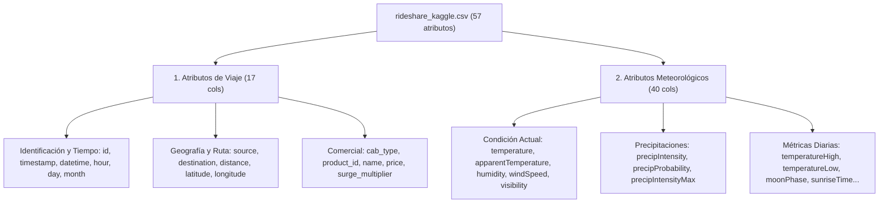
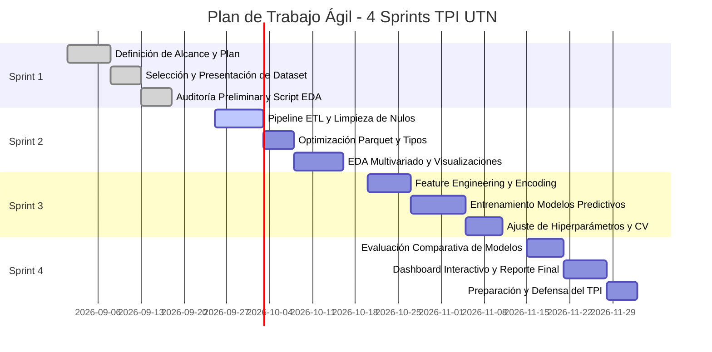

# Trabajo Práctico Integrador (TPI) - UTN
## Análisis de Factores Determinantes en el Precio de Viajes en Plataformas de Movilidad (Uber & Lyft — Boston, MA)


-informational)

---

## 📌 Tabla de Contenidos
1. [Resumen Ejecutivo y Planteamiento del Problema](#1-resumen-ejecutivo-y-planteamiento-del-problema)
2. [Alcance del Proyecto](#2-alcance-del-proyecto)
3. [Presentación y Ficha Técnica del Dataset](#3-presentación-y-ficha-técnica-del-dataset)
4. [Diagnóstico Preliminar de Datos (Insumo para ETL)](#4-diagnóstico-preliminar-de-datos-insumo-para-etl)
5. [Objetivos del Proyecto](#5-objetivos-del-proyecto)
6. [Hipótesis de Trabajo y Hallazgos Esperados](#6-hipótesis-de-trabajo-y-hallazgos-esperados)
7. [Plan de Trabajo Ágil (Scrum — 4 Sprints)](#7-plan-de-trabajo-ágil-scrum--4-sprints)
8. [Matriz de Riesgos y Estrategias de Mitigación](#8-matriz-de-riesgos-y-estrategias-de-mitigación)
9. [Estructura del Repositorio](#9-estructura-del-repositorio)
10. [Instalación y Guía de Ejecución](#10-instalación-y-guía-de-ejecución)

---

## 1. Resumen Ejecutivo y Planteamiento del Problema

En la última década, las aplicaciones de transporte bajo demanda (ridesharing) como **Uber** y **Lyft** han transformado la movilidad urbana global introduciendo algoritmos de fijación dinámica de precios (*surge pricing* o tarifas dinámicas). A diferencia de los taxis convencionales de tarifa fija por bajada de bandera y kilometraje regulado, las plataformas ajustan sus precios en tiempo real de acuerdo a la oferta, la demanda, las condiciones de tráfico, el horario y los fenómenos meteorológicos.

Para los usuarios y reguladores, estos algoritmos suelen operar como "cajas negras", generando incertidumbre en el gasto y debates sobre equidad tarifaria. Este proyecto busca **desmitificar los factores que determinan el precio final de los viajes**, analizando la correlación y peso explicativo de variables operativas, temporales y meteorológicas en la ciudad de Boston, Massachusetts.

### Pregunta Central de Negocio / Investigación:
> **¿En qué medida la distancia, el tipo de servicio, el momento del día y las condiciones climáticas adversas impactan en la fluctuación de tarifas y sobrecargos dinámicos en Uber y Lyft?**

---

## 2. Alcance del Proyecto

### 2.1 Delimitaciones
* **Espacial:** Ciudad de Boston, Massachusetts (EE. UU.), abarcando 12 zonas estratégicas (centros financieros, terminales de transporte, zonas universitarias y residenciales) con 72 pares de rutas origen-destino.
* **Temporal:** 23 días continuos de observación entre el **26 de noviembre y el 18 de diciembre de 2018** (período que captura días laborales, fines de semana y transiciones hacia el invierno con episodios de lluvia y bajas temperaturas).
* **Plataformas de Estudio:** Uber Technologies Inc. y Lyft Inc. (13 variantes de servicio que van desde opciones compartidas económicas hasta servicios premium de lujo).

### 2.2 Inclusiones (In Scope)
* Ingesta, limpieza y normalización de los 693.071 registros mediante un pipeline ETL automatizado y reproducible.
* Análisis exploratorio multivariado (EDA) con análisis de dispersión, estacionalidad horaria y tarifas por milla.
* Ingeniería de características (*feature engineering*) para derivar métricas clave: sobrecargo implícito, distancia Manhattan, categorización de horarios pico (*rush hour* vs. *valle*) y severidad climática.
* Entrenamiento, comparación y validación de modelos analíticos y predictivos de regresión (Machine Learning) para estimación tarifaria.
* Tablero interactivo / reporte ejecutivo de conclusiones para la toma de decisiones informada.

### 2.3 Exclusiones (Out of Scope)
* Despliegue de modelos en producción en tiempo real (streaming o inferencia en vivo mediante API de terceros).
* Generalización del modelo a otras ciudades del mundo con marcos regulatorios o climas radicalmente disímiles.
* Recreación exacta de algoritmos propietarios de asignación de choferes o márgenes de comisión retenidos por la plataforma.

---

## 3. Presentación y Ficha Técnica del Dataset

El conjunto de datos utilizado es el dataset público **"Uber and Lyft Dataset Boston, MA"** alojado en Kaggle, el cual consolida consultas recurrentes a las API de ambas plataformas sincronizadas con la API meteorológica de DarkSky para Boston.

### 3.1 Ficha Técnica Consolidada

| Parámetro | Detalle |
| :--- | :--- |
| **Nombre del archivo** | `rideshare_kaggle.csv` |
| **Tamaño en disco** | ~350.36 MB |
| **Total de Registros (Filas)** | 693.071 |
| **Total de Atributos (Columnas)** | 57 |
| **Clave Primaria Candidata** | `id` (UUID único de 36 caracteres, 0 duplicados) |
| **Ventana Temporal** | 26/11/2018 03:40:46 a 18/12/2018 19:15:10 |
| **Fuentes y Destinos (12)** | Back Bay, Beacon Hill, Boston University, Fenway, Financial District, Haymarket Square, North End, North Station, Northeastern University, South Station, Theatre District, West End |

### 3.2 Clasificación de Atributos



---

## 4. Diagnóstico Preliminar de Datos (Insumo para ETL)

A partir de la ejecución del script exploratorio inicial (`eda_initial.py`), se identificaron las siguientes particularidades críticas que guiarán el diseño del pipeline ETL en el Sprint 2:

### A. Diagnóstico de Valores Faltantes en `price` (55.095 nulos / 7.95%)
* **Hallazgo:** La columna objetivo `price` es la **única columna con valores nulos** en todo el dataset.
* **Causa Raíz:** El **100%** de estos nulos corresponde al servicio `Uber Taxi`. En Boston, los taxis tradicionales solicitados por Uber funcionan con taxímetro físico oficial y no proporcionan tarifa cerrada por adelantado (*upfront price*) en la API.
* **Decisión de Ingeniería ETL:** Dado que no es un error de muestreo sino una característica de negocio, para el entrenamiento de modelos de precios cerrados se **filtrarán estos registros**, garantizando una base de **637.976 viajes válidos** sin introducir distorsiones por imputación artificial.

### B. Asimetría en la Tarifa Dinámica (`surge_multiplier`)
* **Lyft:** Aplica multiplicadores variables explícitos (`1.0`, `1.25`, `1.5`, `1.75`, `2.0`, `2.5`, `3.0`). Un **6.82% de sus viajes** presentan tarifa dinámica activa.
* **Uber:** Muestra un valor estático de `1.0` en el 100% de sus registros, debido a que Uber ya había migrado en 2018 a un esquema de tarifa fija garantizada (*upfront pricing*), empaquetando el sobrecargo en el precio total sin exponer el multiplicador en el endpoint público.
* **Decisión de Ingeniería ETL:** Diseñar una variable derivada de **sobrecargo implícito** para Uber comparando el precio por milla observado contra la mediana base de cada ruta.

### C. Redundancias y Optimización de Almacenamiento
* Se comprobó matemáticamente que `visibility.1` es una copia idéntica al 100% de `visibility`. Será eliminada en la fase de extracción/limpieza.
* Las 40 columnas meteorológicas contienen pronósticos diarios redundantes con timestamps secundarios (`temperatureHighTime`, `windGustTime`) que no aportan valor predictivo al viaje puntual.
* **Consumo de Memoria:** La conversión de tipos de datos en Pandas (casting a `category` para variables discretas y `float32` para métricas continuas) reducirá el uso de memoria RAM de **~725 MB a menos de 85 MB**.

---

## 5. Objetivos del Proyecto

### 5.1 Objetivo General
Desarrollar un flujo analítico y de ciencia de datos integral que permita identificar, cuantificar y modelar los factores operacionales, geoespaciales y climáticos determinantes en la fijación de tarifas de Uber y Lyft en Boston, proporcionando un modelo predictivo robusto e interpretable.

### 5.2 Objetivos Específicos
1. **Ingeniería de Datos (ETL):** Diseñar e implementar un pipeline automatizado para limpiar, filtrar anomalías de taxímetro, eliminar redundancias y exportar un dataset curado y optimizado en formato Parquet.
2. **Análisis Exploratorio (EDA) Avanzado:** Descubrir patrones de demanda temporal (horas pico, fines de semana), comparar las distribuciones de precios entre servicios homólogos (ej. UberX vs. Lyft básico) y correlacionar variables climáticas con el surge pricing.
3. **Ingeniería de Variables (Feature Engineering):** Crear indicadores sintéticos de demanda, severidad climática y sobrecargos implícitos.
4. **Modelado y Machine Learning:** Entrenar y evaluar modelos supervisados de regresión (Linear/Ridge Regression, Random Forest, LightGBM/XGBoost) para estimar el precio del viaje y evaluar el peso explicativo de cada factor (*feature importance*).
5. **Insights y Visualización:** Sintetizar los resultados en dashboards y conclusiones estratégicas respecto al comportamiento de precios de ambas empresas.

---

## 6. Hipótesis de Trabajo y Hallazgos Esperados

| Hipótesis | Fundamento / Comportamiento Esperado | Validación Prevista |
| :--- | :--- | :--- |
| **H1: Dominancia del Tipo de Servicio** | La categoría del vehículo (`name`: Black, Lux, XL, Shared) es el predictor con mayor peso en el precio base, por encima de la distancia. | Análisis de Varianza (ANOVA) y Feature Importance. |
| **H2: Sensibilidad Climática en Lyft** | La lluvia intensa y la visibilidad reducida incrementan significativamente la probabilidad de activación del `surge_multiplier` en Lyft. | Modelos de clasificación logística y correlación de Spearman. |
| **H3: Paridad y Competencia de Tarifas** | En servicios estándar (UberX vs. Lyft) y en igualdad de ruta y distancia, ambas compañías exhiben medianas de precio estadísticamente equivalentes. | Pruebas de hipótesis no paramétricas (Mann-Whitney U). |
| **H4: Picos de Congestión Temporal** | Las franjas horarias matutina (7:00–9:00) y vespertina (17:00–19:00) en días hábiles muestran tarifas por milla significativamente superiores al horario valle. | Análisis de series temporales y descomposición horaria. |

---

## 7. Plan de Trabajo Ágil (Scrum — 4 Sprints)

El proyecto adopta la metodología ágil **Scrum** adaptada a los estándares de la industria en Ciencia de Datos (**CRISP-DM**), organizando las actividades a lo largo del cuatrimestre en cuatro sprints correspondientes a las entregas de la cátedra:



### Detalle de Sprints y Entregables

* **Sprint 1 (Entrega 1 — En curso): Definición de Alcance, Plan de Trabajo y Diagnóstico de Datos**
  * *Objetivo:* Definir el marco de trabajo, alcance, objetivos, hipótesis, matriz de riesgos, caracterización técnica del dataset y script de diagnóstico preliminar.
  * *Entregables:* `README.md` exhaustivo, `eda_initial.py`, `reporte_diagnostico_etl.md` y `requirements.txt`.

* **Sprint 2 (Entrega 2): Ingeniería de Datos (ETL) y EDA Exhaustivo**
  * *Objetivo:* Construir el pipeline de limpieza (filtrado de Taxi, eliminación de `visibility.1`, normalización temporal), optimizar almacenamiento en Parquet y generar visualizaciones univariadas y bivariadas.
  * *Entregables:* Script modular de ETL (`etl_pipeline.py`), dataset curado (`rideshare_clean.parquet`) y notebook de análisis exploratorio con gráficos de correlación y mapas de calor.

* **Sprint 3 (Entrega 3): Ingeniería de Características y Modelado Predictivo**
  * *Objetivo:* Transformación de variables categóricas (One-Hot / Target Encoding), escalado de atributos numéricos, creación de variables de interacción y entrenamiento de modelos de regresión supervisada.
  * *Entregables:* Pipeline de modelado (`train_models.py`), evaluación cruzada y reporte de métricas ($R^2$, RMSE, MAE).

* **Sprint 4 (Entrega 4 — Entrega Final): Evaluación, Dashboard y Conclusiones de Negocio**
  * *Objetivo:* Interpretabilidad de modelos (valores SHAP / Feature Importance), desarrollo de un dashboard interactivo para simulación de tarifas y presentación ejecutiva final.
  * *Entregables:* Dashboard analítico, informe final consolidado y presentación para la defensa oral del proyecto.

---

## 8. Matriz de Riesgos y Estrategias de Mitigación

| # | Riesgo Identificado | Prob. | Impacto | Estrategia de Mitigación / Acción de Contingencia |
| :-: | :--- | :---: | :---: | :--- |
| **R1** | **Valores nulos en variable target (`price`)** | Alta | Alto | Filtrar los 55.095 registros de `Taxi` que carecen de tarifa por diseño de la API. Documentar el sesgo de exclusión y trabajar sobre los 637.976 registros de tarifa cerrada. |
| **R2** | **Alta colinealidad en variables climáticas** | Alta | Medio | Seleccionar atributos representativos y aplicar regularización (Ridge/Lasso) o reducción de dimensionalidad (PCA) durante el Sprint 3. |
| **R3** | **Sobrecarga de memoria RAM por volumen de datos (~700k filas)** | Media | Alto | Implementar lectura por chunks o tipos optimizados (`category`, `float32`) y migrar el formato intermedio de CSV a Apache Parquet con compresión Snappy. |
| **R4** | **Falta de multiplicador explícito en Uber** | Alta | Medio | Crear una variable sintética de sobrecargo relativo comparando el valor por milla contra la tarifa base de referencia de la categoría. |
| **R5** | **Sesgo de ventana temporal reducida (23 días en 2018)** | Media | Bajo | Delimitar claramente las conclusiones a las condiciones climáticas y comerciales de finales de otoño en Boston, evitando extrapolaciones erróneas a otras estaciones del año. |

---

## 9. Estructura del Repositorio

La organización del proyecto sigue las mejores prácticas de la industria para repositorios de Ciencia de Datos:

```text
uber-lyft-dataset/
│
├── README.md                      # Documento principal de entrega (Alcance, Plan, Ficha técnica)
├── requirements.txt               # Especificación de dependencias del entorno Python
├── eda_initial.py                 # Script de diagnóstico preliminar y auditoría pre-ETL
├── reporte_diagnostico_etl.md     # Reporte markdown generado automáticamente por eda_initial.py
├── rideshare_kaggle.csv           # Dataset original sin procesar (~350 MB)
│
├── data/                          # Almacenamiento estructurado de datos (a implementar en Sprint 2)
│   ├── raw/                       # Datos crudos inmutables
│   ├── processed/                 # Datos transformados y curados (Parquet/CSV)
│   └── external/                  # Metadatos externos (ej. feriados locales)
│
├── src/                           # Código fuente modular
│   ├── etl/                       # Módulos de extracción, transformación y carga
│   ├── features/                  # Scripts de ingeniería de variables
│   └── models/                    # Scripts de entrenamiento y evaluación de modelos
│
├── notebooks/                     # Jupyter Notebooks para exploración visual y experimentación
│   └── 01_eda_exploratorio.ipynb
│
└── reports/                       # Reportes generados, gráficos y entregables académicos
    └── figures/                   # Gráficos exportados para la presentación
```

---

## 10. Instalación y Guía de Ejecución

### 10.1 Requisitos Previos
* Python 3.10 o superior instalado.
* Git instalado en el sistema.

### 10.2 Configuración del Entorno Virtual

En la terminal (PowerShell o Bash), clonar el repositorio y configurar el entorno:

```powershell
# 1. Clonar el repositorio (o abrir la carpeta local)
cd "c:\Users\perez\VSProyects\PROYECTOS UTN\uber-lyft-dataset"

# 2. Crear un entorno virtual aislado
python -m venv venv

# 3. Activar el entorno virtual
# En Windows (PowerShell):
.\venv\Scripts\Activate.ps1
# En Linux/macOS:
source venv/bin/activate

# 4. Instalar dependencias requeridas
pip install -r requirements.txt
```

### 10.3 Ejecución del Script Exploratorio Pre-ETL

Para ejecutar la auditoría y generar el informe diagnóstico automático:

```powershell
python eda_initial.py
```

El script ejecutará las siguientes fases en menos de 10 segundos:
1. Perfilado de volumen y consumo de memoria.
2. Auditoría de completitud y explicación del 100% de nulos en `price`.
3. Detección de redundancias estructurales (ej. `visibility.1`).
4. Análisis de distribución de mercado (Uber vs. Lyft), tarifas y dispersión de `surge_multiplier`.
5. Validación espacio-temporal (cobertura geográfica de las 12 zonas de Boston).
6. Exportación automática de `reporte_diagnostico_etl.md` con las especificaciones de transformación para el Sprint 2.

---
**Universidad Tecnológica Nacional (UTN)**  
*Trabajo Práctico Integrador — Cuatrimestre 2026*